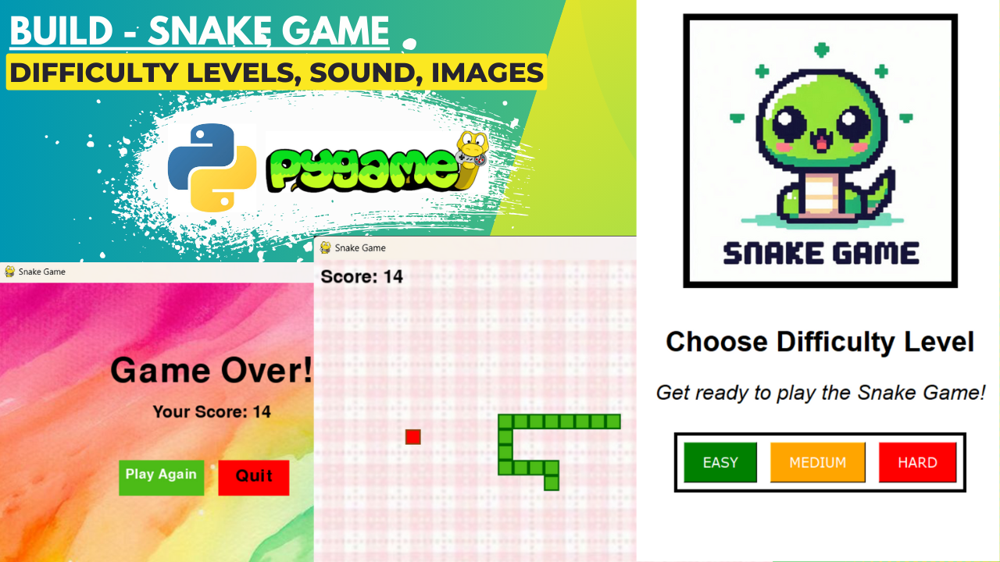

# 🐍 Snake Game in Python 🎮


Welcome to my **Snake Game** built using **Python** and **Pygame**! 🐍🎮 This is a simple, yet fun, retro-inspired game where you control a snake, eat food to grow, and avoid obstacles. Challenge yourself to grow the snake as long as possible without hitting the walls or your own tail.

---

### 🖼️ **Game Screenshot**

Here’s a preview of the game:



---

### 🎥 **Video Demo**

Watch the game in action! Click the thumbnail below to see the game play out:

[](snakegame.mp4)

---

### 📜 **Game Features**
- **Snake Growth**: Eat food to make the snake longer.
- **Simple Controls**: Use arrow keys to navigate.
- **Game Over**: Avoid walls and the snake's tail.
- **Sound Effects**: Enjoy fun sound effects when eating food or when the game ends.

---

### 🚀 **Installation Instructions**

To play the game, follow these easy steps:

1. **Clone the repository**:
   ```bash
   git clone https://github.com/yourusername/snake-game.git
2. Install dependencies: Ensure you have Python and Pygame installed. Run: >> pip install pygame
3. Run the game: Start the game by running: >> python snake.py

🎮 Controls
Arrow Keys: Move the snake up, down, left, and right.
Play Again Button: Restart the game after losing.
Quit Button: Close the game after finishing.
🌟 Contributing
Contributions are welcome! If you'd like to improve this project, feel free to fork it and submit a pull request. If you find any bugs or want to suggest new features, open an issue!

📄 License
This project is licensed under the MIT License - see the LICENSE file for details.

💬 Feedback
I’d love to hear your thoughts! Please feel free to leave feedback, report bugs, or suggest new features via GitHub issues. You can also reach me at choudhuryoliveya15@gmail.com.


